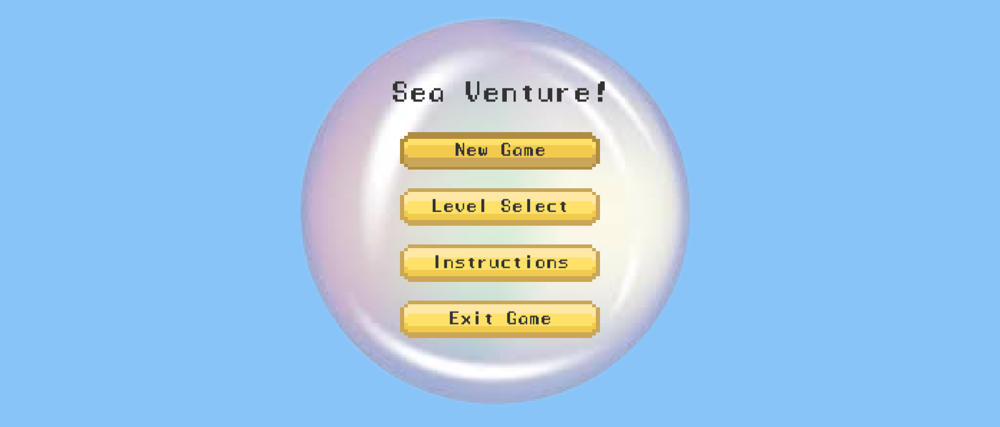

# Sea Venture

A 2D Shooter game where players have to navigate a submarine to uncover underwater treasures while staying safe from lurking sea creatures.

# About the Project

This project was adapted from a template provided in [Game Design and Development 1: 2D Shooter](https://www.coursera.org/learn/game-design-and-development-1) on Coursera.

# Additional Features

* Underwater Theme
* Modified Menu, Graphics & Sound Effects
* Additional Levels & Power Ups
* New Enemies & Obstacles

# Running the Game
1. Visit [this](https://rq27.itch.io/sea-venture) website.
2. Play from your browser or download the zip file for Windows / MacOS depending on your device.

## Tech Stack

## License

Distributed under the MIT License. See [LICENSE](https://github.com/ruiqi7/sea-venture/blob/main/LICENSE) for more information.